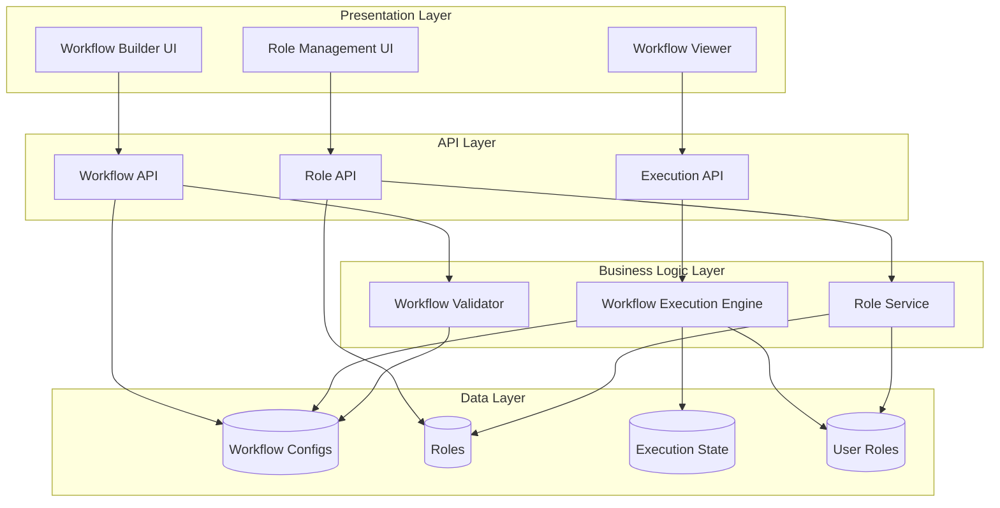
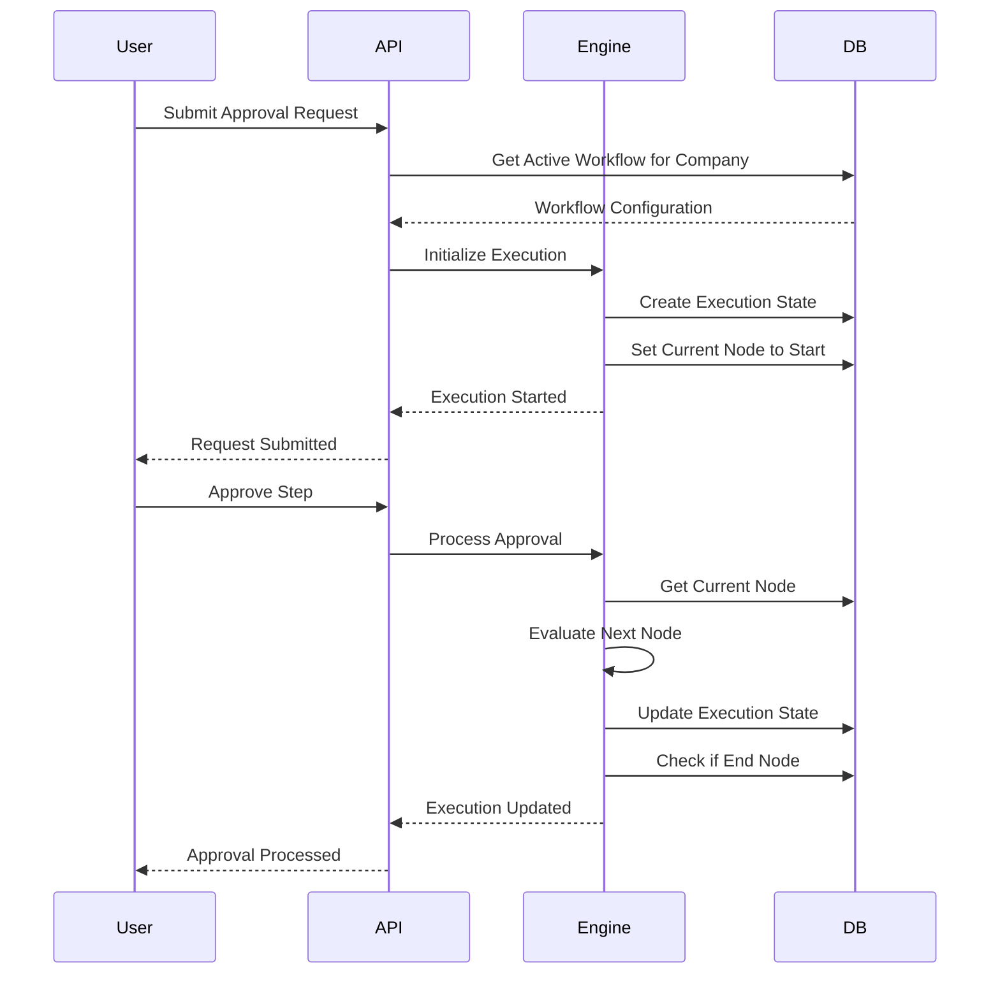

# Design Document: Customizable Approval Workflows

## Overview

This design document specifies the architecture for a customizable approval workflow system that enables system administrators to create company-specific approval flows through a visual workflow builder. The system replaces the current hardcoded approval flow with a dynamic, multi-tenant solution.

### Key Design Goals

1. **Visual Workflow Builder**: Drag-and-drop interface for non-technical users to design approval workflows
2. **Multi-Tenant Isolation**: Complete separation of workflow configurations and role definitions by company
3. **Workflow Versioning**: Support for updating workflows without affecting in-progress requests
4. **Flexible Node Types**: Support for sequential approvals, parallel approvals, and conditional routing
5. **Real-Time Execution**: Dynamic workflow execution engine that processes requests according to custom configurations
6. **State Persistence**: Comprehensive tracking of workflow execution state for audit and visibility

### Technology Stack

- **Frontend**: React 18 with TypeScript, Tailwind CSS
- **Workflow Builder UI**: React Flow (react-flow-renderer) for visual workflow canvas
- **Backend**: Next.js 14 API routes
- **Database**: MongoDB with Mongoose ODM
- **Validation**: Zod for schema validation
- **State Management**: SWR for data fetching and caching

## Architecture

### System Components

The system consists of four primary architectural layers:

1. **Presentation Layer**: Visual workflow builder and role management UI
2. **API Layer**: RESTful endpoints for workflow CRUD, role management, and execution control
3. **Business Logic Layer**: Workflow execution engine and validation services
4. **Data Layer**: MongoDB collections for workflows, roles, and execution state


### Architecture Diagram



### Multi-Tenant Isolation Strategy

All workflow-related data is isolated by company using the following approach:

1. **Company-Scoped Queries**: All database queries include company ID filter
2. **Middleware Validation**: API middleware validates user's company matches requested resource
3. **Session-Based Context**: User's company ID stored in session and used for all operations
4. **Index Strategy**: Compound indexes on (companyId, resourceId) for performance and isolation

### Workflow Execution Flow



## Components and Interfaces

### Frontend Components

#### WorkflowBuilder Component

The main visual workflow builder interface using React Flow.

**Props:**
```typescript
interface WorkflowBuilderProps {
  companyId: string;
  workflowId?: string; // For editing existing workflow
  onSave: (workflow: WorkflowConfiguration) => Promise<void>;
  onValidate: (workflow: WorkflowConfiguration) => ValidationResult;
}
```

**Key Features:**
- Drag-and-drop node palette
- Canvas for arranging nodes
- Connection drawing between nodes
- Node property editor panel
- Validation feedback display
- Undo/redo functionality
- Auto-layout capability

**Node Types:**
- StartNode: Single entry point for workflow
- EndNode: Terminal nodes for workflow completion
- ApprovalNode: Requires action from specified role
- ParallelSplitNode: Splits flow into multiple parallel paths
- ParallelJoinNode: Waits for all parallel paths to complete
- ConditionalNode: Routes based on request properties

#### RoleManagement Component

Interface for creating and managing custom roles.

**Props:**
```typescript
interface RoleManagementProps {
  companyId: string;
}
```

**Features:**
- Role creation form
- Role list with edit/delete actions
- Usage indicator (shows if role is used in workflows)
- User assignment interface

#### WorkflowViewer Component

Read-only visualization of workflow for end users.

**Props:**
```typescript
interface WorkflowViewerProps {
  workflowId: string;
  executionStateId?: string; // Highlights current position
  showHistory?: boolean;
}
```


### Backend Services

#### WorkflowExecutionEngine

Core service responsible for executing workflows.

**Interface:**
```typescript
interface IWorkflowExecutionEngine {
  // Initialize a new workflow execution
  initializeExecution(
    requestId: string,
    workflowId: string,
    companyId: string
  ): Promise<ExecutionState>;
  
  // Process an action at current node
  processAction(
    executionId: string,
    action: WorkflowAction,
    userId: string
  ): Promise<ExecutionState>;
  
  // Get current execution state
  getExecutionState(executionId: string): Promise<ExecutionState>;
  
  // Evaluate conditional node
  evaluateCondition(
    nodeId: string,
    requestData: any
  ): Promise<boolean>;
  
  // Handle parallel split
  createParallelPaths(
    executionId: string,
    splitNodeId: string
  ): Promise<ParallelPath[]>;
  
  // Handle parallel join
  checkParallelCompletion(
    executionId: string,
    joinNodeId: string
  ): Promise<boolean>;
}
```

**Key Responsibilities:**
- Load workflow configuration for company
- Maintain execution state in database
- Navigate between nodes based on workflow definition
- Handle parallel execution paths
- Evaluate conditional routing
- Trigger notifications for pending approvals

#### WorkflowValidator

Service for validating workflow configurations.

**Interface:**
```typescript
interface IWorkflowValidator {
  validate(workflow: WorkflowConfiguration): ValidationResult;
  validateStructure(workflow: WorkflowConfiguration): ValidationResult;
  validateConnections(workflow: WorkflowConfiguration): ValidationResult;
  validateRoles(workflow: WorkflowConfiguration, companyId: string): Promise<ValidationResult>;
}
```

**Validation Rules:**
- Exactly one start node
- At least one end node
- All nodes reachable from start
- No orphaned nodes
- Parallel splits have matching joins
- All referenced roles exist
- Conditional nodes have exactly two outputs (true/false)
- No circular dependencies (except intentional loops)


#### RoleService

Service for managing custom roles and user assignments.

**Interface:**
```typescript
interface IRoleService {
  createRole(role: CustomRole, companyId: string): Promise<CustomRole>;
  updateRole(roleId: string, updates: Partial<CustomRole>): Promise<CustomRole>;
  deleteRole(roleId: string, companyId: string): Promise<void>;
  getRoles(companyId: string): Promise<CustomRole[]>;
  assignUserToRole(userId: string, roleId: string): Promise<void>;
  removeUserFromRole(userId: string, roleId: string): Promise<void>;
  getUsersByRole(roleId: string, companyId: string): Promise<User[]>;
  isRoleInUse(roleId: string, companyId: string): Promise<boolean>;
}
```

### API Endpoints

#### Workflow Management

**POST /api/workflows**
- Create new workflow configuration
- Body: `WorkflowConfiguration`
- Returns: Created workflow with ID

**GET /api/workflows/:id**
- Retrieve workflow configuration
- Returns: `WorkflowConfiguration`

**PUT /api/workflows/:id**
- Update workflow configuration (creates new version)
- Body: `WorkflowConfiguration`
- Returns: Updated workflow with new version

**DELETE /api/workflows/:id**
- Delete workflow (only if no active executions)
- Returns: Success status

**GET /api/workflows/company/:companyId**
- List all workflows for company
- Returns: Array of `WorkflowConfiguration`

**GET /api/workflows/:id/versions**
- Get version history for workflow
- Returns: Array of workflow versions

**POST /api/workflows/:id/validate**
- Validate workflow configuration
- Body: `WorkflowConfiguration`
- Returns: `ValidationResult`

**POST /api/workflows/:id/activate**
- Set workflow as active version for company
- Returns: Success status


#### Role Management

**POST /api/roles**
- Create custom role
- Body: `CustomRole`
- Returns: Created role with ID

**GET /api/roles/:id**
- Retrieve role details
- Returns: `CustomRole`

**PUT /api/roles/:id**
- Update role name/description
- Body: `Partial<CustomRole>`
- Returns: Updated role

**DELETE /api/roles/:id**
- Delete role (only if not in use)
- Returns: Success status

**GET /api/roles/company/:companyId**
- List all roles for company
- Returns: Array of `CustomRole`

**POST /api/roles/:id/users**
- Assign user to role
- Body: `{ userId: string }`
- Returns: Success status

**DELETE /api/roles/:id/users/:userId**
- Remove user from role
- Returns: Success status

**GET /api/roles/:id/users**
- Get users assigned to role
- Returns: Array of `User`

#### Workflow Execution

**POST /api/executions**
- Initialize workflow execution for request
- Body: `{ requestId: string, workflowId: string }`
- Returns: `ExecutionState`

**GET /api/executions/:id**
- Get execution state
- Returns: `ExecutionState`

**POST /api/executions/:id/actions**
- Process action (approve, reject, etc.)
- Body: `WorkflowAction`
- Returns: Updated `ExecutionState`

**GET /api/executions/request/:requestId**
- Get execution state for request
- Returns: `ExecutionState`


## Data Models

### WorkflowConfiguration

Stores the complete workflow definition for a company.

```typescript
interface WorkflowConfiguration {
  _id: string;
  companyId: string;
  name: string;
  description?: string;
  version: number;
  isActive: boolean;
  nodes: WorkflowNode[];
  edges: WorkflowEdge[];
  createdBy: string; // User ID
  createdAt: Date;
  updatedAt: Date;
}

interface WorkflowNode {
  id: string;
  type: 'start' | 'end' | 'approval' | 'parallel_split' | 'parallel_join' | 'conditional';
  label: string;
  position: { x: number; y: number };
  data: NodeData;
}

interface NodeData {
  // For approval nodes
  roleId?: string;
  
  // For conditional nodes
  condition?: {
    field: string; // e.g., 'costEstimate', 'expenseCategory'
    operator: 'eq' | 'ne' | 'gt' | 'gte' | 'lt' | 'lte' | 'contains';
    value: any;
  };
  
  // UI metadata
  description?: string;
}

interface WorkflowEdge {
  id: string;
  source: string; // Source node ID
  target: string; // Target node ID
  label?: string; // For conditional edges: 'true' or 'false'
  type?: 'default' | 'conditional';
}
```

**MongoDB Schema:**
```typescript
const workflowConfigurationSchema = new mongoose.Schema({
  companyId: { 
    type: mongoose.Schema.Types.ObjectId, 
    ref: 'Company', 
    required: true,
    index: true 
  },
  name: { type: String, required: true },
  description: { type: String },
  version: { type: Number, required: true, default: 1 },
  isActive: { type: Boolean, default: false },
  nodes: [{
    id: { type: String, required: true },
    type: { 
      type: String, 
      enum: ['start', 'end', 'approval', 'parallel_split', 'parallel_join', 'conditional'],
      required: true 
    },
    label: { type: String, required: true },
    position: {
      x: { type: Number, required: true },
      y: { type: Number, required: true }
    },
    data: {
      roleId: { type: mongoose.Schema.Types.ObjectId, ref: 'CustomRole' },
      condition: {
        field: { type: String },
        operator: { type: String, enum: ['eq', 'ne', 'gt', 'gte', 'lt', 'lte', 'contains'] },
        value: { type: mongoose.Schema.Types.Mixed }
      },
      description: { type: String }
    }
  }],
  edges: [{
    id: { type: String, required: true },
    source: { type: String, required: true },
    target: { type: String, required: true },
    label: { type: String },
    type: { type: String, enum: ['default', 'conditional'], default: 'default' }
  }],
  createdBy: { type: mongoose.Schema.Types.ObjectId, ref: 'User', required: true },
}, { timestamps: true });

// Compound index for company + version queries
workflowConfigurationSchema.index({ companyId: 1, version: -1 });
// Index for finding active workflow
workflowConfigurationSchema.index({ companyId: 1, isActive: 1 });
```


### CustomRole

Stores custom roles defined by companies for their workflows.

```typescript
interface CustomRole {
  _id: string;
  companyId: string;
  name: string;
  description?: string;
  createdAt: Date;
  updatedAt: Date;
}
```

**MongoDB Schema:**
```typescript
const customRoleSchema = new mongoose.Schema({
  companyId: { 
    type: mongoose.Schema.Types.ObjectId, 
    ref: 'Company', 
    required: true,
    index: true 
  },
  name: { type: String, required: true },
  description: { type: String },
}, { timestamps: true });

// Ensure role names are unique within a company
customRoleSchema.index({ companyId: 1, name: 1 }, { unique: true });
```

### UserRoleAssignment

Maps users to custom roles within their company.

```typescript
interface UserRoleAssignment {
  _id: string;
  userId: string;
  roleId: string;
  companyId: string;
  assignedAt: Date;
}
```

**MongoDB Schema:**
```typescript
const userRoleAssignmentSchema = new mongoose.Schema({
  userId: { 
    type: mongoose.Schema.Types.ObjectId, 
    ref: 'User', 
    required: true 
  },
  roleId: { 
    type: mongoose.Schema.Types.ObjectId, 
    ref: 'CustomRole', 
    required: true 
  },
  companyId: { 
    type: mongoose.Schema.Types.ObjectId, 
    ref: 'Company', 
    required: true,
    index: true 
  },
  assignedAt: { type: Date, default: Date.now }
});

// Compound indexes for efficient queries
userRoleAssignmentSchema.index({ userId: 1, companyId: 1 });
userRoleAssignmentSchema.index({ roleId: 1, companyId: 1 });
// Prevent duplicate assignments
userRoleAssignmentSchema.index({ userId: 1, roleId: 1 }, { unique: true });
```


### ExecutionState

Tracks the runtime state of a workflow execution for a specific request.

```typescript
interface ExecutionState {
  _id: string;
  requestId: string;
  workflowId: string;
  workflowVersion: number;
  companyId: string;
  currentNodeId: string;
  status: 'in_progress' | 'completed' | 'rejected';
  parallelPaths: ParallelPath[];
  history: ExecutionHistoryEntry[];
  startedAt: Date;
  completedAt?: Date;
}

interface ParallelPath {
  pathId: string;
  splitNodeId: string;
  joinNodeId: string;
  currentNodeId: string;
  status: 'active' | 'completed';
  completedAt?: Date;
}

interface ExecutionHistoryEntry {
  nodeId: string;
  nodeType: string;
  action: 'entered' | 'approved' | 'rejected' | 'routed';
  userId?: string;
  notes?: string;
  timestamp: Date;
  routingDecision?: boolean; // For conditional nodes
}
```

**MongoDB Schema:**
```typescript
const executionStateSchema = new mongoose.Schema({
  requestId: { 
    type: String, 
    required: true,
    unique: true,
    index: true 
  },
  workflowId: { 
    type: mongoose.Schema.Types.ObjectId, 
    ref: 'WorkflowConfiguration', 
    required: true 
  },
  workflowVersion: { type: Number, required: true },
  companyId: { 
    type: mongoose.Schema.Types.ObjectId, 
    ref: 'Company', 
    required: true,
    index: true 
  },
  currentNodeId: { type: String, required: true },
  status: { 
    type: String, 
    enum: ['in_progress', 'completed', 'rejected'],
    default: 'in_progress',
    index: true
  },
  parallelPaths: [{
    pathId: { type: String, required: true },
    splitNodeId: { type: String, required: true },
    joinNodeId: { type: String, required: true },
    currentNodeId: { type: String, required: true },
    status: { type: String, enum: ['active', 'completed'], default: 'active' },
    completedAt: { type: Date }
  }],
  history: [{
    nodeId: { type: String, required: true },
    nodeType: { type: String, required: true },
    action: { 
      type: String, 
      enum: ['entered', 'approved', 'rejected', 'routed'],
      required: true 
    },
    userId: { type: mongoose.Schema.Types.ObjectId, ref: 'User' },
    notes: { type: String },
    timestamp: { type: Date, default: Date.now },
    routingDecision: { type: Boolean }
  }],
  startedAt: { type: Date, default: Date.now },
  completedAt: { type: Date }
});

// Index for finding active executions by company
executionStateSchema.index({ companyId: 1, status: 1 });
```


### Integration with Existing Request Model

The existing `Request` model will be extended to reference workflow execution:

```typescript
// Add to existing Request schema
{
  workflowExecutionId: { 
    type: mongoose.Schema.Types.ObjectId, 
    ref: 'ExecutionState' 
  },
  useCustomWorkflow: { 
    type: Boolean, 
    default: false 
  }
}
```

This allows the system to support both:
1. Legacy hardcoded workflow (when `useCustomWorkflow = false`)
2. Custom workflow (when `useCustomWorkflow = true` and `workflowExecutionId` is set)

## Correctness Properties

*A property is a characteristic or behavior that should hold true across all valid executions of a system—essentially, a formal statement about what the system should do. Properties serve as the bridge between human-readable specifications and machine-verifiable correctness guarantees.*


### Property 1: Role Creation and Storage

*For any* custom role with valid name and company ID, creating the role should result in a stored role with a unique identifier and correct company association.

**Validates: Requirements 1.2**

### Property 2: Role Name Update Propagation

*For any* custom role used in workflows, updating the role name should update all references to that role in existing workflows for the company.

**Validates: Requirements 1.3**

### Property 3: Role Deletion Protection

*For any* custom role used in an active workflow, attempting to delete the role should be rejected and the role should remain in the system.

**Validates: Requirements 1.4**

### Property 4: Multi-Tenant Data Isolation

*For any* company, querying workflows, roles, or execution states should return only data belonging to that company and never include data from other companies.

**Validates: Requirements 1.5, 1.6, 4.3, 8.1, 8.2, 8.3, 8.5**

### Property 5: Workflow Configuration Round-Trip

*For any* valid workflow configuration, saving then loading the workflow should return an equivalent configuration with all nodes, edges, positions, and properties preserved.

**Validates: Requirements 4.1, 4.4**

### Property 6: Workflow Company Association

*For any* saved workflow configuration, it should be associated with exactly one company ID.

**Validates: Requirements 4.2**

### Property 7: Workflow Validation - Single Start Node

*For any* workflow configuration, validation should reject workflows with zero start nodes or more than one start node.

**Validates: Requirements 5.1**

### Property 8: Workflow Validation - Minimum End Nodes

*For any* workflow configuration, validation should reject workflows with zero end nodes.

**Validates: Requirements 5.2**

### Property 9: Workflow Validation - Node Reachability

*For any* workflow configuration, validation should reject workflows containing nodes that are not reachable from the start node.

**Validates: Requirements 5.3**

### Property 10: Workflow Validation - Parallel Split-Join Matching

*For any* workflow configuration, validation should reject workflows where parallel split nodes do not have corresponding parallel join nodes.

**Validates: Requirements 5.4**

### Property 11: Invalid Workflow Activation Prevention

*For any* workflow configuration that fails validation, attempting to activate it should be rejected.

**Validates: Requirements 5.6**


### Property 12: Execution Initialization at Start Node

*For any* new workflow execution, the initial current node should be the workflow's start node.

**Validates: Requirements 6.2**

### Property 13: Execution Uses Company Workflow

*For any* approval request, the workflow execution should use the active workflow configuration belonging to the request's company.

**Validates: Requirements 6.1, 8.4**

### Property 14: Approval Advances to Next Node

*For any* approval action at an approval node, the execution state should advance to the next node connected by an outgoing edge from the current node.

**Validates: Requirements 6.3**

### Property 15: Role-Based Approval Authorization

*For any* approval node requiring a specific role, only users assigned to that role within the company should be able to complete the approval action.

**Validates: Requirements 6.4**

### Property 16: Parallel Split Creates Multiple Paths

*For any* execution reaching a parallel split node, the number of parallel paths created should equal the number of outgoing edges from that node.

**Validates: Requirements 6.5**

### Property 17: Parallel Join Waits for All Paths

*For any* execution with parallel paths reaching a join node, the execution should not advance beyond the join node until all parallel paths have completed.

**Validates: Requirements 6.6**

### Property 18: Conditional Routing Based on Evaluation

*For any* execution reaching a conditional node, the next node should be determined by following the edge labeled 'true' if the condition evaluates to true, or the edge labeled 'false' if the condition evaluates to false.

**Validates: Requirements 6.7, 12.3, 12.4, 12.5**

### Property 19: End Node Marks Completion

*For any* execution reaching an end node, the execution status should be set to 'completed'.

**Validates: Requirements 6.8**

### Property 20: Execution State Persistence

*For any* active workflow execution, the system should maintain a current node ID indicating the execution's position in the workflow.

**Validates: Requirements 7.1**

### Property 21: Step Completion Timestamp Recording

*For any* completed workflow step, the execution history should contain a timestamp for when that step was completed.

**Validates: Requirements 7.2**

### Property 22: Step Completion User Tracking

*For any* approval action in the execution history, the history entry should contain the user ID of the user who performed the action.

**Validates: Requirements 7.3**


### Property 23: Workflow Version Increment on Update

*For any* workflow configuration being updated, saving the modified workflow should create a new version with a version number incremented from the previous version.

**Validates: Requirements 9.1**

### Property 24: In-Progress Executions Use Original Version

*For any* in-progress workflow execution, updating the workflow configuration should not change the workflow version used by that execution.

**Validates: Requirements 9.2**

### Property 25: New Executions Use Active Version

*For any* new workflow execution, the system should use the workflow version marked as active for the company.

**Validates: Requirements 9.3**

### Property 26: Workflow Version History Retention

*For any* workflow with multiple versions, all previous versions should be retrievable from the system.

**Validates: Requirements 9.4**

### Property 27: Multiple Role Assignments Per User

*For any* user within a company, the system should allow assignment to multiple custom roles simultaneously.

**Validates: Requirements 10.1, 10.4**

### Property 28: Role Assignment Removal

*For any* existing user-role assignment, the system should allow removal of that assignment.

**Validates: Requirements 10.2**

### Property 29: Approval Node User Identification

*For any* approval node with a specified role, the system should identify all users assigned to that role within the execution's company.

**Validates: Requirements 10.3**

### Property 30: Any Assigned User Can Approve

*For any* approval node where multiple users are assigned to the required role, any one of those users completing the approval should advance the workflow.

**Validates: Requirements 10.5**

### Property 31: Invalid Node Connection Prevention

*For any* connection attempt between incompatible node types, the system should reject the connection.

**Validates: Requirements 11.4**

### Property 32: Conditional Node Two-Output Validation

*For any* conditional node in a workflow, validation should reject the workflow if the node does not have exactly two outgoing connections labeled 'true' and 'false'.

**Validates: Requirements 12.6**


## Error Handling

### Validation Errors

**Workflow Validation Errors:**
- `WORKFLOW_INVALID_START_NODES`: Workflow must have exactly one start node
- `WORKFLOW_INVALID_END_NODES`: Workflow must have at least one end node
- `WORKFLOW_UNREACHABLE_NODES`: All nodes must be reachable from start node
- `WORKFLOW_UNMATCHED_PARALLEL`: Parallel split nodes must have corresponding join nodes
- `WORKFLOW_INVALID_CONDITIONAL`: Conditional nodes must have exactly two outputs labeled true/false
- `WORKFLOW_INVALID_ROLE_REFERENCE`: Referenced role does not exist in company

**Role Management Errors:**
- `ROLE_IN_USE`: Cannot delete role that is used in active workflows
- `ROLE_NAME_DUPLICATE`: Role name already exists for this company
- `ROLE_NOT_FOUND`: Specified role does not exist

**Execution Errors:**
- `EXECUTION_WORKFLOW_NOT_FOUND`: No active workflow found for company
- `EXECUTION_INVALID_NODE`: Current node does not exist in workflow
- `EXECUTION_UNAUTHORIZED_USER`: User not assigned to required role
- `EXECUTION_INVALID_ACTION`: Action not valid for current node type
- `EXECUTION_PARALLEL_INCOMPLETE`: Cannot advance past join until all paths complete

### Multi-Tenant Security Errors

- `UNAUTHORIZED_COMPANY_ACCESS`: User attempting to access data from different company
- `INVALID_COMPANY_CONTEXT`: Company ID missing or invalid in request

### Error Response Format

All API errors follow consistent format:

```typescript
interface ErrorResponse {
  error: {
    code: string;
    message: string;
    details?: any;
  };
}
```

### Error Handling Strategy

1. **Validation Layer**: Catch validation errors before database operations
2. **Authorization Layer**: Verify company context and user permissions
3. **Business Logic Layer**: Handle workflow execution errors gracefully
4. **Database Layer**: Handle connection and query errors with retries
5. **Client Layer**: Display user-friendly error messages with actionable guidance


## Testing Strategy

### Dual Testing Approach

This feature requires both unit testing and property-based testing to ensure comprehensive coverage:

**Unit Tests** focus on:
- Specific examples of workflow configurations
- Edge cases (empty workflows, single-node workflows)
- Error conditions and validation failures
- Integration between components
- API endpoint behavior with specific inputs

**Property-Based Tests** focus on:
- Universal properties that hold across all valid inputs
- Comprehensive input coverage through randomization
- Workflow execution correctness across diverse configurations
- Multi-tenant isolation guarantees
- Data integrity during concurrent operations

Together, these approaches provide comprehensive coverage where unit tests catch concrete bugs and property-based tests verify general correctness.

### Property-Based Testing Configuration

**Library Selection:**
- Use `fast-check` for TypeScript/JavaScript property-based testing
- Minimum 100 iterations per property test to ensure thorough randomization
- Each property test must reference its design document property using comment tags

**Tag Format:**
```typescript
// Feature: customizable-approval-workflows, Property {number}: {property_text}
```

**Example Property Test:**
```typescript
import fc from 'fast-check';

// Feature: customizable-approval-workflows, Property 1: Role Creation and Storage
test('role creation stores with unique ID and company association', async () => {
  await fc.assert(
    fc.asyncProperty(
      fc.record({
        name: fc.string({ minLength: 1, maxLength: 50 }),
        companyId: fc.uuid(),
        description: fc.option(fc.string())
      }),
      async (roleData) => {
        const created = await roleService.createRole(roleData, roleData.companyId);
        expect(created._id).toBeDefined();
        expect(created.companyId).toBe(roleData.companyId);
        expect(created.name).toBe(roleData.name);
      }
    ),
    { numRuns: 100 }
  );
});
```


### Unit Test Coverage

**Role Management:**
- Create role with valid data
- Create role with duplicate name (should fail)
- Update role name
- Delete unused role
- Delete role in use (should fail)
- Assign user to role
- Remove user from role
- Query roles by company

**Workflow Configuration:**
- Create simple linear workflow
- Create workflow with parallel paths
- Create workflow with conditional routing
- Save and load workflow (round-trip)
- Validate workflow with missing start node
- Validate workflow with multiple start nodes
- Validate workflow with unreachable nodes
- Activate valid workflow
- Attempt to activate invalid workflow (should fail)

**Workflow Execution:**
- Initialize execution at start node
- Process approval and advance to next node
- Handle parallel split creation
- Handle parallel join waiting
- Evaluate conditional routing (true path)
- Evaluate conditional routing (false path)
- Complete execution at end node
- Unauthorized user approval attempt (should fail)

**Multi-Tenant Isolation:**
- Query workflows for company A (should not return company B data)
- Query roles for company A (should not return company B data)
- Attempt cross-company workflow access (should fail)
- Execution uses correct company workflow

**Versioning:**
- Create initial workflow version
- Update workflow creates new version
- In-progress execution uses original version after update
- New execution uses latest active version

### Integration Testing

**End-to-End Workflow Scenarios:**
1. Admin creates roles → builds workflow → activates → user submits request → approval flows through workflow → completion
2. Admin updates workflow → existing requests continue on old version → new requests use new version
3. Parallel approval scenario with multiple approvers
4. Conditional routing based on cost threshold

### Performance Testing

**Load Testing Scenarios:**
- Concurrent workflow executions (100+ simultaneous)
- Large workflow configurations (50+ nodes)
- High-frequency role queries
- Bulk user-role assignments

**Performance Targets:**
- Workflow execution initialization: < 200ms
- Approval action processing: < 150ms
- Workflow validation: < 100ms
- Role query: < 50ms

### Security Testing

**Multi-Tenant Isolation:**
- Verify no data leakage between companies
- Test authorization middleware on all endpoints
- Verify company context in all database queries

**Input Validation:**
- Test with malformed workflow configurations
- Test with invalid role references
- Test with SQL injection attempts (should be prevented by Mongoose)
- Test with XSS attempts in role names and descriptions

